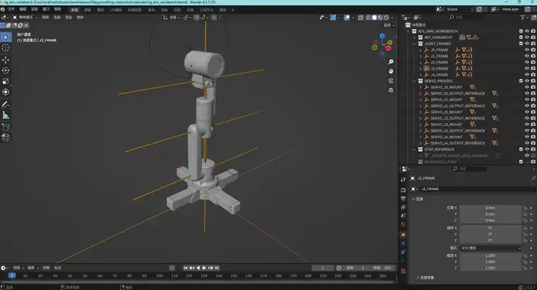
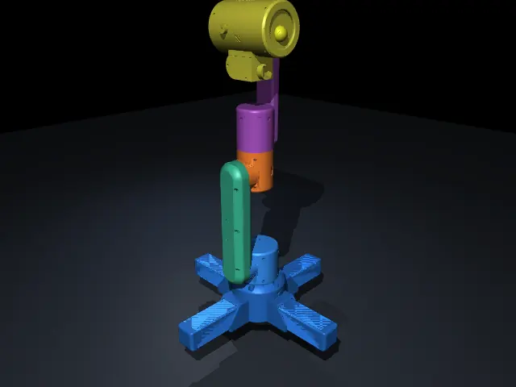

最近一直在折腾 RIG-Creature。最开始买 RIG-Arm 的时候，我就没太想把它当普通机械臂来做。我更想让它像一个桌面上的小生物：不靠一张“脸”或者几段固定动画，而是靠持续的感知、内部状态和动作变化，让人觉得它真的在观察、犹豫、靠近和躲开。

不过真正动手以后，我发现离 Motion Engine 还早。先把“身体”做对，反而成了第一件事。

## 从数学骨架到真实外形

我先在 MuJoCo 里复现了 firmware 的 J0–J4 运动学，5000 组随机姿态的 FK 都能对上。但这只能证明仿真模型和 firmware 的数学定义一致，不代表它已经和真机的机械几何一致。

于是后面又开 Blender，把官方打印件一块块重新装起来。GPT 主要帮我判断遇到的问题到底属于 visual、parenting 还是 kinematics，Codex 负责把 workbench、脚本和测试落到仓库里，我拿着真机做最后判断。

中间有几个坑挺值得记。

舵机 proxy 我们前后改了好几轮：查型号、找 STEP、拿卡尺量尺寸，最后才意识到它只是装配夹具，没必要追求生产级精度。真正重要的是轴心和大致体积，最终 visual 里这些 helper 都可以直接去掉。

另一个坑是 parenting。静态看着完全正常的模型，一转 LINK0 才发现 J0 的舵机机身也跟着一起转了。从那以后，我每绑完一段零件都会直接把对应 link 转十几度，看谁应该动、谁不该动。

## 那个 3.5 mm

装到肘部时，我发现小臂中心线和肩部并不完全重合。以同一个连接平面为基准，肩部关节圆心大约是 23.9 mm，肘部是 20.4 mm，正好差 3.5 mm。

我把 LINK2 整条后续链往 `-Y` 移了 3.5 mm，外形一下就顺了。这里也差点犯了一个很典型的错误：如果 J2、J3 各自都加 3.5 mm，parent transform 会累计成 7 mm。

这件事也把一个概念彻底分开了：**firmware-equivalent 不等于 physical-geometry-equivalent。** 手工装配反而帮我找到了真实结构里被数学模型抽象掉的机械偏置。

## 第一次真的像一台机器人了

Blender 装完之后，Codex 又把 BASE、LINK0 到 LINK4 的 visual mesh 自动导回 MuJoCo，同时继续保留原来的 primitive collision。

第一次看到这个画面的时候还是挺有成就感的。它现在还没有内部状态、reactive behavior，也还没有真正开始做我最期待的 Creature Motion Engine，但至少已经有了一具我愿意拿来判断动作的身体。

而且做到这里我越来越确定：如果真的想让它显得“活着”，很多关键工作其实发生在 LLM 之前。
